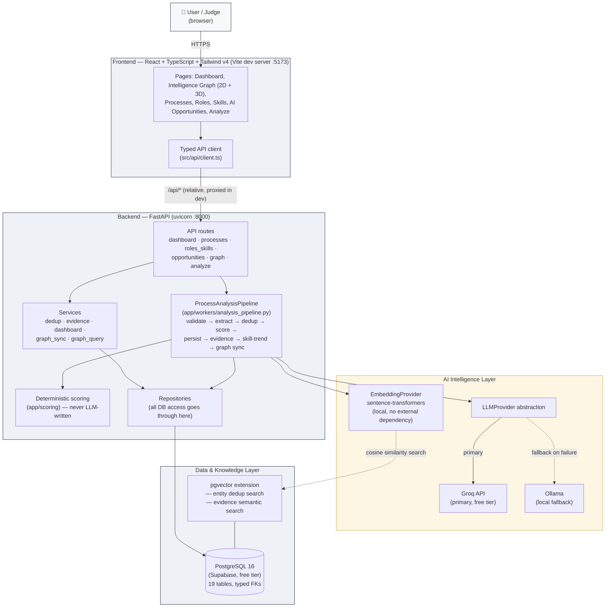

# AEGISAI — Architecture Diagram

Matches the actual implemented system as of Phase 8 — not an aspirational
diagram drawn before the code existed. Every box below corresponds to real,
tested code in this repository.

## System architecture

## The Surprise Record Test pipeline (the core intelligence flow)

```mermaid
flowchart LR
    Input["Input<br/>(process name, typed by anyone —<br/>judge or seed script, same code path)"]
    Validate["Backend validation<br/>(name length, duplicate check,<br/>value_chain exists)"]
    Extract["AI analysis<br/>LLM extraction — activities, roles,<br/>skills, AI opportunities<br/>(strict JSON schema, retry-then-fail)"]
    Dedup["Embedding-based dedup<br/>pgvector cosine search vs.<br/>existing roles/skills"]
    Score["Deterministic scoring<br/>weighted formula, never LLM-written"]
    Evidence["Evidence retrieval<br/>semantic search vs. curated<br/>research corpus (best-effort)"]
    Persist["Database persistence<br/>(one atomic transaction)"]
    GraphUpdate["Graph update<br/>(denormalized graph_edges sync)"]
    UIUpdate["UI visualization<br/>(dashboard, graph, detail pages<br/>all reflect it immediately)"]

    Input --> Validate --> Extract --> Dedup --> Score --> Evidence --> Persist --> GraphUpdate --> UIUpdate

    style Extract fill:#fdf6e3,stroke:#d4a73c
    style Dedup fill:#eef1f6,stroke:#1b2a4a
    style Score fill:#eef1f6,stroke:#1b2a4a
```

**Nothing here is hard-coded for any specific process name.** This exact
pipeline is what `scripts/seed_processes.py` used to seed all 10 initial
processes, and it's what `POST /api/processes/analyze` runs for any live
input — verified directly: running it twice with overlapping role/skill
names reuses the existing entities (proven with matching UUIDs across two
independent live Groq calls — see `docs/architecture/decision-log.md`).

## Synchronous vs. asynchronous operations

| Operation | Type | Notes |
|---|---|---|
| Dashboard/list/detail reads | Synchronous | Simple DB queries, sub-100ms typically |
| `POST /api/processes/analyze` | Synchronous request, internally multi-stage | Real Groq call in the critical path — 10–30s response time. Built to be poll-friendly (`AnalysisJob` status tracked throughout) even though the current endpoint blocks until completion |
| Graph traversal (`GET /api/graph/...`) | Synchronous | BFS over `graph_edges`, a handful of queries per request |

## Why this shape, not something else

Full reasoning for every major architectural decision — why Postgres over
Neo4j, why Supabase over local Docker, why Groq+Ollama, why the denormalized
`graph_edges` table alongside typed junction tables, why entity dedup is
decoupled from embedding generation — is in
[`docs/architecture/decision-log.md`](./decision-log.md), which also
documents two real incidents encountered while building this (an Alembic
configparser bug, and a production data-loss incident with its structural
fix) with full technical detail, since that level of honesty is more
defensible in a technical interview than a diagram that only shows the
happy path.
